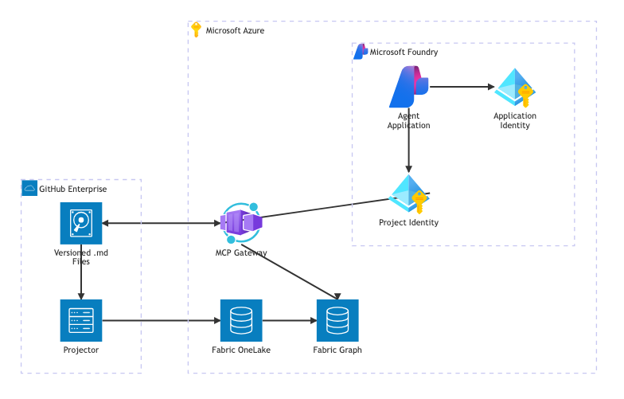
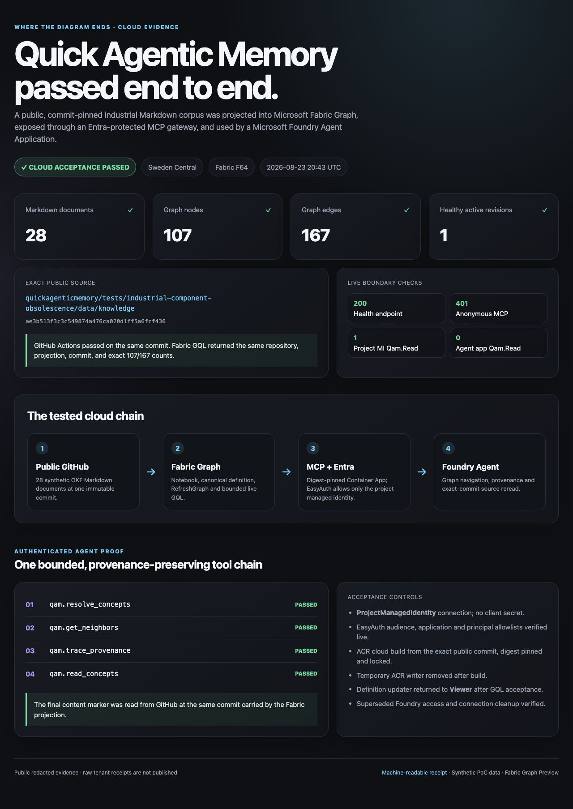

# Quick Agentic Memory



Microsoft Fabric is shown inside the Microsoft Azure boundary throughout this proof.

[Read the architecture](docs/ARCHITECTURE.md)

> **Experimental proof of concept:** implemented with separate local and fully parameterized Azure/Fabric/Foundry acceptance paths. The synthetic industrial showcase has passed the complete cloud path; deployment in another tenant remains an explicit, authorized operator action.

This is my small workbench for turning architectural ideas into executable proofs—where the diagram ends and the test begins. The idea is simple: seeing is believing, but a result is only useful when it can be traced back to the exact knowledge that produced it.

## Why this proof exists

### Enterprise knowledge should compound

> **Your existing enterprise data is the gold. The next competitive advantage is a governed knowledge dimension that connects it across systems and makes its context usable by people and agents.**

As AI agents begin to support real engineering decisions, enterprises need more than another way to search what they already own. The important question is: **how can the value distributed across existing systems gain durable identities, relationships, explanations, and provenance without being copied into another master data store?**

PLC projects, drawings, PLM records, MES transactions, and engineering systems remain authoritative for their operational and engineering data. Human-readable `.md` files add a durable knowledge dimension for the decisions, explanations, relationships, and source references that cross those system boundaries. The wiki enriches the landscape; it does not take ownership of the underlying data.

This is an Azure extension story, not a data migration story. Azure runs and protects the MCP gateway, Microsoft Fabric provides the derived relationship graph, and Microsoft Foundry gives the agent bounded tools to navigate it and reread the exact knowledge file at the same commit. Those services make the additional dimension usable without replacing the systems that hold the enterprise data.

[Andrej Karpathy's sketch of a persistent, compounding wiki](https://gist.github.com/karpathy/442a6bf555914893e9891c11519de94f) points in that direction: an agent-maintained, interlinked body of ordinary `.md` files can accumulate synthesis and cross-references instead of reconstructing them from raw documents for every question. Quick Agentic Memory adapts the durable, interlinked knowledge pattern for a governed manufacturing read proof. It is an independent implementation, not a copy of the gist's code or exact architecture.

### Why manufacturing exposes the gap

In manufacturing, a seemingly simple question such as “What changes when this field component reaches end of life?” is usually a relationship problem. The answer can span delivered machine variants, electrical mappings, PLC diagnostic blocks, parameter sets, service and change records, and controlled FAT/SAT specifications. Missing one link can make an otherwise fluent answer incomplete.

Search and RAG remain valuable for finding related text. Their retrieval stage alone does not guarantee stable component identity, complete multi-hop impact coverage, lifecycle filtering, exclusion of near-name distractors, or one consistent source revision. Quick Agentic Memory tests those additional controls as a graph-and-provenance layer; it does not claim that graphs universally replace RAG.

The synthetic public scenario makes the difference visible with `IOL-M8`: two delivered variants have distinct controlled impact chains, while `IOL-M8S` and superseded guidance are deliberate distractors. The experiment compares the lexical BM25 retrieval stage with bounded link traversal over the same `.md` files and records what each method retrieved. It evaluates retrieval evidence, not LLM answer style.

### One knowledge record, not competing stores

Quick Agentic Memory does not ask anyone to move enterprise data into GitHub or maintain the same wiki knowledge in GitHub and Fabric. Each layer has one responsibility:

| Layer | Purpose | Authority |
| --- | --- | --- |
| PLC, PLM, MES, drawings, and engineering systems | Operational records, engineering artifacts, transactions, and domain data | Authoritative in their respective domains |
| Version-controlled `.md` files in GitHub | Cross-system meaning, context, decisions, relationships, source references, proposed-change review, and version history | Authoritative for the added knowledge dimension |
| Microsoft Fabric Graph | Fast identity resolution and bounded relationship traversal generated from one Git commit | Derived, rebuildable index |
| MCP gateway and Foundry Agent Application | Governed navigation followed by an exact-commit source read | Read-only consumers; they do not own the knowledge |

Fabric stores projected identifiers, relationships, hashes, and commit provenance—not the underlying enterprise records and not a second editable copy of the Markdown document bodies. The agent uses the graph to find a route, then returns to GitHub and hash-checks the original `.md` file at the same commit. **The operational systems hold the data; Markdown adds the cross-system knowledge; the graph holds only the routes through it.**

At small scale, Git and linked `.md` files may be enough. Add a graph only when stable identity, bounded multi-hop navigation, governed agent access, or scale justifies a generated index. The architectural pattern is deliberately general: human-readable `.md` files use lightweight metadata and explicit links, while the projector is an adapter that can evolve independently of the knowledge record.

### Govern maintenance in GitHub

QAM should not invent a second approval system. GitHub is the native authoring and governance surface for the knowledge files:

1. A human—or, in a future curation path, an agent—prepares a change on a branch against an exact base commit.
2. A pull request makes the Markdown diff, rationale, sources, and link changes reviewable.
3. The checked-in [**QAM validate** workflow](../.github/workflows/qam-validate.yml) tests relevant pull requests, including knowledge validation, builds, tests, secret checks, and the local proof path.
4. Repository rulesets or branch protection can require that check, approving reviews, code-owner approval, resolved conversations, and an up-to-date branch before merge.
5. Only the merged commit becomes input to a new deterministic Fabric projection; neither a curator nor a reviewer edits the graph directly.

The current published Foundry Agent Application exposes only the seven read-only tools. The MCP gateway contains an optional, disabled-by-default proposal transport, but this repository does not yet ship the service that creates the GitHub branch, commit, and pull request. CODEOWNERS, required reviewers, and repository rules are also administrator-owned GitHub settings and must be configured separately. In other words, this PoC demonstrates a governed, commit-pinned read path and the correct native approval boundary—not yet a complete agent-driven authoring lifecycle.

## Public evidence

[](tests/industrial-component-obsolescence/screens/04-cloud-chain-acceptance.jpg)

The redacted cloud proof shows the tested chain from one public Git commit through Fabric Graph, the Entra-protected MCP gateway, and the Foundry Agent Application. It records 28 source documents, 107 graph nodes, 167 edges, live boundary checks, and the four ordered agent tool events. The [evidence gallery](tests/industrial-component-obsolescence/screens/) also contains the local retrieval comparison, public GitHub source view, Foundry smoke trace, checksums, and a machine-readable redacted cloud receipt.

Quick Agentic Memory makes linked `.md` files in GitHub navigable and exposes them to agents through a constrained MCP interface:

- GitHub contains the version-controlled knowledge record intended for pull-request review.
- A validator checks the lightweight metadata, structure, and explicit links required for projection.
- The Fabric Graph Projector creates a deterministic, commit-pinned snapshot that must satisfy the canonical `qam-graph/1.0` executable contract.
- Microsoft Fabric Graph stores the rebuildable navigation index, not the Markdown document bodies.
- The Wiki MCP Gateway gives a published Microsoft Foundry Agent Application exactly seven bounded read-only tools for graph navigation and exact-commit source retrieval.

The projection component is deliberately called **Fabric Graph Projector**: it creates a disposable read model and never turns the graph into a second source of truth.

## Repository map

| Path | Purpose |
| --- | --- |
| [`knowledge/`](knowledge/) | Small linked `.md` knowledge set used by the complete local test. |
| [`contracts/`](contracts/) | Canonical executable `qam-graph/1.0` contract shared by projection, Fabric decoding, and MCP retrieval. |
| [`packages/core/`](packages/core/) | Validator, deterministic projector, manifest, and CLI. |
| [`packages/mcp/`](packages/mcp/) | Read-only MCP gateway with local and cloud adapter boundaries. |
| [`agents/foundry/`](agents/foundry/) | Published Foundry Agent Application registration, identity bootstrap, and smoke test. |
| [`infra/`](infra/) | Azure Bicep, Fabric integration guidance, and deployment parameters. |
| [`scripts/`](scripts/) | Validation, what-if, deployment, and smoke-test helpers. |
| [`tests/industrial-component-obsolescence/`](tests/industrial-component-obsolescence/) | Synthetic industrial A/B proof comparing classical BM25 chunk retrieval with bounded graph and provenance retrieval. |
| [`docs/ARCHITECTURE.md`](docs/ARCHITECTURE.md) | Architecture, Azure diagrams, security boundaries, and WAF assessment. |
| [`docs/TESTING.md`](docs/TESTING.md) | Local, infrastructure, identity, and authorized cloud acceptance gates. |
| [`docs/CLOUD_REPRODUCTION.md`](docs/CLOUD_REPRODUCTION.md) | Canonical public-SHA installation and full Azure/Fabric/Foundry acceptance runbook. |

## How to install and run locally

Prerequisites are Git, Node.js 22 or newer, and npm. From the directory in which you want the repository:

```bash
git clone https://github.com/DittmannAxel/Where-the-Diagram-Ends.git
cd Where-the-Diagram-Ends/quickagenticmemory
npm ci
npm run verify
npm run demo
```

`verify` checks contract synchronization, type-checks, tests, and builds both packages. `demo` validates the fixture, generates a graph and manifest under `.artifacts/local-demo/`, starts the MCP test path, and proves graph navigation plus commit-pinned Markdown retrieval.

No cloud resources are required for this path and no tracked repository or tenant state is modified. The demo refreshes only its ignored `.artifacts/local-demo/` directory; sibling cloud receipts under `.artifacts/` are preserved.

## Demo walkthrough: what you will see

The repository provides three deliberately separate proof levels. Use the first for a fast mechanics check, the second to present the manufacturing retrieval difference, and the third to inspect the recorded Azure/Fabric/Foundry result.

| Proof level | What to open or run | Visible result |
| --- | --- | --- |
| Local mechanics | Run `npm run demo` from `quickagenticmemory/`. | A small fixture becomes a 26-node/32-edge projection; MCP navigation finds a two-hop path, exposes seven read-only tools, and rereads the commit-pinned Markdown. This is not the industrial scenario or a cloud test. |
| Manufacturing comparison | Open the self-contained [`report.html`](tests/industrial-component-obsolescence/screens/evidence/latest/report.html) from a local clone, or start with [`01-overview.png`](tests/industrial-component-obsolescence/screens/01-overview.png). | Eight accepted cases, a QAM-minus-BM25 required-concept recall difference of `+29` percentage points, a mean precision difference of `+53` points, excluded hits of `15 / 0`, and `100%` QAM link-path coverage. |
| Cloud and agent proof | Open the self-contained [`cloud-proof.html`](tests/industrial-component-obsolescence/screens/evidence/latest/cloud-proof.html), or view [`04-cloud-chain-acceptance.jpg`](tests/industrial-component-obsolescence/screens/04-cloud-chain-acceptance.jpg) followed by [`05-foundry-agent-smoke.jpg`](tests/industrial-component-obsolescence/screens/05-foundry-agent-smoke.jpg). | The recorded public-commit run shows 28 Markdown documents becoming 107 nodes and 167 edges, live GQL and authorization-boundary checks, and four completed Foundry tool events. |

### A ten-minute presentation

1. **Frame the manufacturing question.** Ask: “Which delivered machine variants use `IOL-M8` directly, and which I/O mappings, PLC diagnostic blocks, parameter sets, and FAT/SAT cases must be reviewed for replacement? Exclude `IOL-M8S` and cite the relationship paths.” The challenge is completeness, correct identity, scope, and source revision—not merely finding text that sounds similar.
2. **Show the overview.** Open the prepared report and point to the `8/8` machine-readable acceptance result and the aggregate differences. Explain that BM25 is the lexical retrieval arm over the same Markdown, while QAM resolves a concept and follows bounded explicit links. This evaluates retrieved evidence, not a generated LLM answer.
3. **Select case `Q-005-pkg-chain`.** The BM25 arm retrieves two of six required PKG-200 concepts and also returns two out-of-scope concepts; QAM retrieves all six with no excluded hit. The strongest visual is also available as [`02-pkg-200-link-traversal.png`](tests/industrial-component-obsolescence/screens/02-pkg-200-link-traversal.png).
4. **Follow the evidence paths.** The report shows `IOL-M8 → PKG-200/V500` and the linked `IO-MAP-17`, `FB_IO_DIAG`, `PARAM-SET-17`, `FAT-042`, and `SAT-021` records. Each selected source read carries its content hash and the report's Git commit, while the similarly named stainless branch remains outside the result.
5. **Finish in the cloud proof.** Show the chain `Public GitHub → Fabric Graph → MCP + Entra → Foundry Agent`, then the ordered events `qam.resolve_concepts → qam.get_neighbors → qam.trace_provenance → qam.read_concepts`. The final read uses the same full Git commit carried by the graph projection. The `200` health check, anonymous MCP `401`, and managed-identity access counts make the security boundaries visible as part of the demonstration. This smoke proves the protected navigation and provenance chain for `IOL-M8`; it does not claim that the same run generated the complete manufacturing impact answer.

The honest conclusion is intentionally narrow: on this synthetic corpus, bounded graph traversal preserves the required relationship chains, exclusions, and commit provenance that the lexical top-k arm can miss. It is evidence for complementing a RAG design where those controls matter, not a claim that QAM universally replaces RAG. The local report and the cloud acceptance were captured in separate public runs at the commits named inside each artifact.

To regenerate the industrial report without replacing the checked-in presentation evidence, use an ignored output directory from a clean commit:

```bash
cd quickagenticmemory/tests/industrial-component-obsolescence/code
./run.sh --output ../../../.artifacts/industrial-demo --require-clean-commit
```

Then open `quickagenticmemory/.artifacts/industrial-demo/report.html`. To reproduce the tenant-authorized cloud result instead of presenting the recorded evidence, continue with the deployment section below and the [complete cloud runbook](docs/CLOUD_REPRODUCTION.md).

## How to deploy and test the complete Azure proof

The canonical cloud entry point is the fail-closed [`cloud-run.sh`](tests/industrial-component-obsolescence/code/cloud-run.sh) driver. It deploys the Azure foundation, Fabric and Foundry platform, graph data plane, ACR-built MCP image, Entra identities and access, Container App, Agent Application, and the final end-to-end smoke test. It then emits `cloud-acceptance.json` only if every stage passed.

> **Permissions and lifecycle:** the example configuration selects a Fabric F64 capacity and a Foundry model deployment. Run it only in an isolated resource group with an authorized Azure/Fabric/Entra operator, and pause the Fabric capacity after the test. Regional service availability and model quota are tenant-specific.

### 1. Install the operator tools

You need Azure CLI with Bicep and the Container Apps extension, Bash, Git, `curl`, `jq`, `uuidgen`, `base64`, `openssl`, Node.js 22 with npm, Python 3.11 or newer, and `uv`. Docker is not required because Azure Container Registry builds the image from the public Git commit.

```bash
az bicep install
az extension add --name containerapp --upgrade
az login
az account set --subscription '<subscription-name-or-id>'

for QAM_NAMESPACE in \
  Microsoft.App \
  Microsoft.ContainerRegistry \
  Microsoft.CognitiveServices \
  Microsoft.Fabric \
  Microsoft.Insights \
  Microsoft.KeyVault \
  Microsoft.ManagedIdentity \
  Microsoft.Network \
  Microsoft.OperationalInsights
do
  az provider register --namespace "${QAM_NAMESPACE}" --wait
done
```

The signed-in user must be the configured Fabric capacity administrator, Foundry operator, and final smoke-test invoker. Provider registration and creation of a new resource group require subscription-level permissions. Before continuing, complete the detailed [cloud prerequisites](docs/CLOUD_REPRODUCTION.md#prerequisites), including the Fabric tenant setting for service principals.

### 2. Select one validated public commit

Choose a full commit SHA whose public GitHub Actions **QAM validate / validate** check succeeded, then use a clean detached checkout:

```bash
git clone https://github.com/DittmannAxel/Where-the-Diagram-Ends.git qam-public-proof
cd qam-public-proof
git checkout --detach '<40-lowercase-public-git-sha>'
git rev-parse HEAD
git status --short
```

The command uses the public upstream source. If your fork is the configured source, replace the clone URL with that fork's canonical `.git` URL. In either case, use the same repository in `cloud-config.json`. The final command must print nothing. The driver rejects a private or dirty source, a branch name, an abbreviated SHA, and a commit without the successful check for that repository.

The source may be this upstream repository or your public fork. If the fork is the configured source, clone that fork, enable Actions there, and require `validate` on its exact commit. The separate OIDC credential must always target a repository and GitHub Environment that you administer; it can target your controlled fork even when the interactive driver reads the public upstream source. Never bind an Azure federated credential to a repository or Environment controlled by someone else.

### 3. Bootstrap the isolated deployment identity

If the tenant does not already have a separately governed GitHub OIDC deployment principal, the bootstrap can create the isolated resource group, user-assigned identity, and an Azure federated credential scoped to the operator-controlled GitHub Environment. Creating a new resource group and registering providers requires the subscription permissions listed in the runbook:

```bash
quickagenticmemory/scripts/bootstrap-github-oidc.sh \
  --subscription-id '<azure-subscription-id>' \
  --resource-group '<new-or-existing-isolated-resource-group>' \
  --location '<supported-azure-region>' \
  --github-owner '<your-fork-owner>' \
  --github-repository '<your-fork-repository>' \
  --github-environment qam-test
```

Keep the printed `AZURE_PRINCIPAL_ID`; it becomes `principals.deploymentPrincipalId` in the cloud configuration. The interactive driver still runs as the signed-in user. The OIDC identity is the separately governed role target, is used as the deployment caller only by the protected GitHub workflow, and must remain distinct from the runtime managed identity.

The bootstrap does not create or protect the GitHub Environment. A repository administrator must create `qam-test`, configure reviewers and branch restrictions, and add the printed non-secret variables before using the workflow. The interactive driver needs only the separate role target.

### 4. Create the ignored configuration

```bash
mkdir -p quickagenticmemory/.artifacts
cp \
  quickagenticmemory/tests/industrial-component-obsolescence/code/cloud-config.example.json \
  quickagenticmemory/.artifacts/cloud-config.json

az ad signed-in-user show \
  --query '{fabricAdminMember:userPrincipalName,objectId:id}' \
  --output json
```

Edit only the ignored `cloud-config.json`. Set the public repository, canonical `.git` URL, exact SHA, subscription, resource group, region, printed OIDC principal ID, signed-in user's UPN/object ID, and an available tool-capable Foundry model/version. For a first run, set `principals.temporaryAcrWriter` to the signed-in user; use `null` only if that user already has `Container Registry Repository Writer` on the registry. Remove every `<placeholder>`.

Keep the scenario contract unchanged: `image.repository` is `qam-mcp`; `foundry.connectionName` is `qam-mcp-project-identity`; cleanup remains `true`; and acceptance remains 28 documents, 107 nodes, 167 edges, `IOL-M8`, and `XK8-IO`.

### 5. Run acceptance and pause the Fabric capacity

```bash
quickagenticmemory/tests/industrial-component-obsolescence/code/cloud-run.sh \
  --config quickagenticmemory/.artifacts/cloud-config.json
```

The driver prints the private receipt path only after terminal acceptance. Its `cleanup` stage removes superseded access; it does **not** pause or delete deployed resources. If the run reached the `platform` stage, follow the [capacity lifecycle step](docs/CLOUD_REPRODUCTION.md#pause-the-fabric-capacity) after acceptance or after any later failure/interruption.

For the complete permission checklist, resource-provider registration, resumable stages, receipt checks, and capacity pause/resume command, use the canonical [public-SHA cloud runbook](docs/CLOUD_REPRODUCTION.md).

## How the cloud proof works

The live path is intentionally staged: deploy the foundation and isolated identities first; explicitly deploy the Fabric/Foundry platform; publish the graph projection generated from one approved commit to Fabric; configure GitHub source access and the Foundry project's system-assigned managed identity; then deploy the allowlisted Container App and attach the MCP-enabled Agent Application version. The application image is built inside ACR from that exact public Git URL and full commit SHA, so the reproducible cloud path needs no local Docker daemon; its checked-in helper waits for a terminal run, locks the output digest, and emits a source-bound JSON receipt. The Agent Application keeps a distinct identity for publication and invocation, while the secretless `ProjectManagedIdentity` RemoteTool connection uses the project identity for outbound MCP calls. OneLake publication uses a unique temporary directory, read-back byte and SHA-256 verification, and an atomic no-replace rename. The repository also creates the Fabric Workspace, Lakehouse, Graph Model, and Notebook through public APIs, generates the canonical Graph definition from the checked-in contract, and completes the official on-demand `RefreshGraph` job before accepting GQL evidence.

Nothing in `npm run verify` or `npm run demo` creates cloud resources. Azure deployment, role assignment, secret configuration, Fabric publication, and live smoke tests are separate operator actions and require explicit authorization. `scripts/deploy-industrial-platform.sh` provides an idempotent tenant-neutral deployment-and-smoke path without making what-if mandatory; `scripts/publish-industrial-fabric.sh` applies the clean commit-pinned data plane. The public [cloud evidence](tests/industrial-component-obsolescence/screens/) records the successful redacted acceptance outcome. See also the [industrial scenario](tests/industrial-component-obsolescence/README.md), [infrastructure guide](infra/README.md), and [Foundry guide](agents/foundry/README.md).

## Security stance

The default MCP surface contains exactly `browse_index`, `resolve_concepts`, `get_neighbors`, `get_backlinks`, `find_path`, `read_concepts`, and `trace_provenance`. It does not accept arbitrary GQL, content paths are confined to the configured knowledge root, proposal/write behavior is disabled by default, and projected data carries its Git commit.

GitHub Actions uses OIDC for Azure deployment. The Foundry project's system-assigned managed identity is the outbound MCP caller and receives only `Qam.Read`; EasyAuth requires its exact token audience, client ID, and principal ID and deliberately contains no group-authorization rule. The published Agent Application retains a separate `defaultInstanceIdentity`, while an inbound operator or automation identity receives `Foundry User` only at that application scope. The Container App uses its own user-assigned managed identity for Fabric, Key Vault, and telemetry. This public showcase reads the exact public Git commit without a credential; a private deployment can instead use a selected-repository GitHub App with only `Contents: read` and a PEM private key kept in Key Vault. Fabric documents Viewer for Graph queries, but the industrial cloud path explicitly uses workspace Contributor as an observed managed-identity Preview compatibility workaround; that write-capable role is a recorded PoC risk and must be retested for downgrade to Viewer.

This remains a PoC, not a production claim. A live test still needs tenant-specific GitHub, Fabric, Foundry, and Azure configuration plus explicit deployment authorization.

[Back to Where the Diagram Ends](../README.md)
