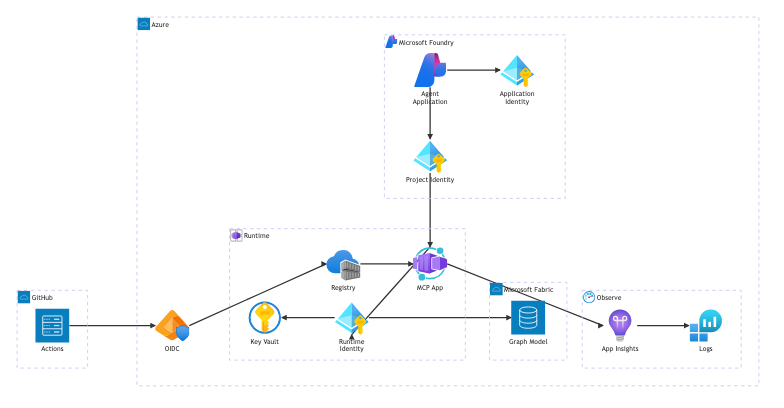

# Quick Agentic Memory on Azure

This directory contains the reproducible Azure PoC deployment for the MCP gateway. It deploys an Azure Container Apps workload, Azure Container Registry, two user-assigned managed identities, Key Vault, Log Analytics, Application Insights, and optional Private Link networking. A separate opt-in template can provision the paid Fabric capacity and Microsoft Foundry account, project, and model deployment used by the complete test.

No deployment is performed by committing or validating these files. Every mutating Azure or Fabric operation is an explicit script or manually dispatched workflow.



## What is deployed

| Component | Purpose | Security baseline |
| --- | --- | --- |
| Container Apps | Hosts the MCP HTTP server on port 3000 | HTTPS-only ingress, health probes, single active revision, required built-in Entra authentication, mandatory caller application **and** principal allow-lists, scale-to-zero |
| Runtime managed identity | Calls Fabric and resolves the selected GitHub credential from Key Vault | Available only to the main container; an explicit administrator phase assigns Key Vault Secrets User and Monitoring Metrics Publisher |
| Pull managed identity | Pulls the MCP image | The administrator phase assigns Container Registry Repository Reader on one ABAC-enabled registry; identity lifecycle is `None`, so it is not available inside the container |
| ACR | Stores commit-SHA-tagged images | ABAC repository-permission mode, admin and anonymous pull disabled; the administrator phase gives the deploy identity Container Registry Repository Writer only on this registry; pushed manifests are locked and Container Apps deploys the resolved `sha256` digest, never the tag |
| Key Vault | Holds a GitHub App PEM key or explicit token fallback | Azure RBAC, purge protection, 90-day soft delete, empty legacy access-policy list, and an RG-scoped Deny assignment that requires the RBAC permission model; secret values never enter Bicep |
| Log Analytics | Stores Container Apps logs and metrics | Azure Monitor diagnostic settings; no workspace shared key is passed to Container Apps; local authentication disabled |
| Application Insights | Application telemetry target | Workspace-based, local authentication disabled, managed-identity authentication variables injected |
| Private networking | Removes public data-plane access to ACR, Key Vault, and Container Apps ingress | Dedicated VNet subnets, Private Endpoints, and Private DNS zones; opt-in because of cost and runner requirements |
| Optional Fabric capacity | Supplies F SKU compute for the Graph proof | Separate paid `platform.bicep` deployment, constrained to F2/F4/F8; an explicit lifecycle script can show, suspend, or resume it |
| Optional Foundry platform | Supplies the AIServices account, project, and pinned chat-model deployment | System-assigned identities, local key authentication disabled, and Foundry Project Manager scoped to the project; public networking and Global Standard processing are explicit PoC tradeoffs |

The deployed container uses the direct adapters:

- `QAM_GRAPH_ADAPTER=fabric-gql` with the Fabric workspace and Graph Model IDs;
- `QAM_CONTENT_ADAPTER=github`, `QAM_SOURCE_REPOSITORY=<canonical HTTPS URL>`, and the authoritative repository/origins;
- the runtime managed identity for `https://api.fabric.microsoft.com/.default`;
- recommended GitHub App authentication through a Key Vault-backed `QAM_GITHUB_PRIVATE_KEY`; `QAM_GITHUB_TOKEN` is an explicit mutually exclusive fallback.

## Files

- `main.bicep` composes the deployment modules.
- `admin.bicep` references the deterministic existing foundation resources and creates only four narrow role assignments plus the resource-group-scoped Key Vault RBAC Deny policy. It contains no deployable service-resource definitions.
- `platform.bicep` is the separate opt-in, paid Fabric-capacity and Foundry account/project/model deployment. It does not create Fabric workspace items. Tenant identities are runtime parameters rather than checked-in values.
- `main.poc.bicepparam` is the public-network PoC baseline.
- `main.private.bicepparam` enables Private Link and ACR Premium.
- `modules/` contains small service-focused Bicep modules.
- `../scripts/validate-infra.sh` builds the foundation, isolated-admin, and paid-platform Bicep templates plus every parameter set; validates their compiled security/cost contracts; checks Bash syntax; and runs ShellCheck, actionlint, a redacted secret scan, and negative CLI tests. CI fails if those tools are unavailable.
- `../scripts/what-if.sh` previews Azure changes; its explicit `--include-role-assignments` mode selects only `admin.bicep` and is administrator-only.
- `../scripts/deploy.sh` performs one ARM deployment phase and emits its outputs as JSON. The same administrator-only flag selects only `admin.bicep`, creates exactly four role assignments plus the Key Vault RBAC Deny policy, and requires `--skip-app`.
- `../scripts/platform-what-if.sh` previews the paid Fabric/Foundry platform with runtime-supplied tenant identities.
- `../scripts/platform-deploy.sh` explicitly creates or reconciles that platform and emits non-secret ARM outputs.
- `../scripts/deploy-industrial-platform.sh` is the explicit end-to-end administrator orchestrator: it deploys the paid platform, creates or reuses the isolated Fabric workspace and items, grants workspace roles, and performs a real bounded Foundry inference. A separate what-if is optional, not a hidden prerequisite.
- `../scripts/bootstrap-fabric-items.sh` exact-name reconciles the Fabric workspace, Lakehouse, Preview Graph Model, and checked-in `fabricGitSource` Notebook; duplicates and reuse on another capacity fail closed.
- `../scripts/generate-fabric-graph-definition.sh` deterministically generates the four public Graph Model definition parts for the canonical `QamNode` and `QamEdge` Delta tables without overwriting reviewed files.
- `../scripts/publish-industrial-fabric.sh` orchestrates immutable OneLake publication, the checked-in Notebook, generated Graph definition update, and the commit-pinned live GQL gate.
- `../scripts/smoke-test-foundry.sh` performs one real, bounded, Entra-authenticated Responses API inference and emits only the expected text and token counts.
- `../scripts/manage-fabric-capacity.sh` defaults to a read-only status call; `--action suspend` and `--action resume` are explicit capacity mutations.
- `../scripts/bootstrap-github-oidc.sh` creates the environment-bound Azure identity with only resource-group Contributor and fails closed if any effective direct or inherited role still grants `roleAssignments/write`.
- `../scripts/build-push-image.sh` builds, pushes, locks, resolves, and emits an immutable manifest digest.
- `../scripts/bootstrap-mcp-entra.sh` reconciles the Entra MCP API, `Qam.Read` role, assignment-required policy, and allowed caller service principals.
- `../scripts/grant-fabric-access.sh` idempotently grants Viewer separately to the runtime identity and protected GQL-smoke identity; only an explicitly selected definition updater receives Contributor.
- `../scripts/validate-github-access.sh` validates mutually exclusive GitHub credentials and can prove a bounded, commit-pinned Markdown `Contents: read` from the exact repository without printing secrets.
- `../scripts/smoke-test.sh` verifies anonymous `/healthz` and requires anonymous `/mcp` to return `401`.
- `../scripts/update-fabric-graph-definition.sh` updates an existing Graph Model from a generated or separately reviewed public definition.
- `../scripts/smoke-test-fabric-graph.sh` runs a read-only Preview GQL query.
- `../../.github/workflows/qam-validate.yml` runs tests, Bicep validation, shell checks, and an image build.
- `../../.github/workflows/qam-deploy.yml` uses GitHub OIDC for a manually approved deployment.

The parameter examples intentionally contain placeholders and default to `deployContainerApp = false`. `main.bicep` has no role-assignment or policy-assignment parameter or resource; privileged reconciliation exists only in `admin.bicep`. The scripts require a lowercase OCI digest for an application deployment. A commit tag remains a build locator only.

## Prerequisites

Local tooling:

- Azure CLI with Bicep CLI;
- Docker;
- `jq`, `curl`, and a POSIX environment with Bash;
- ShellCheck for local shell linting (CI also runs it).

Azure and Entra prerequisites:

1. An Azure subscription where an administrator can bootstrap an isolated resource group.
2. An Entra application representing the MCP API plus at least one explicitly assigned caller. Built-in Container Apps authentication is mandatory. Easy Auth requires both the caller's application/client ID (`appid`/`azp`) and service-principal object ID (`oid`); a valid token from any other tenant identity is rejected.
3. A protected GitHub Environment named `qam-dev`, `qam-test`, or `qam-prod`. Configure required reviewers and deployment branch restrictions before adding its federated credential.
4. A DNS- and network-connected self-hosted runner with the label `qam-private` when Private Link is selected.

Fabric prerequisites are separate because `platform.bicep` cannot establish Fabric workspace access or create tenant-scoped Fabric items:

1. The Fabric tenant administrator enables **Service principals can use Fabric APIs** for an appropriately scoped security group when the runtime or deployment service principal will call Fabric APIs.
2. The identity running the item bootstrap has permission to create a workspace on the selected capacity, is capacity Contributor/Admin as required, and can administer workspace roles. The current Preview Graph Model create API supports a delegated user, service principal, or managed identity; non-user identities also require the corresponding tenant setting and scoped Fabric permissions.
3. Either the supported capacity, workspace, Lakehouse, Notebook, and Graph Model already exist, or the administrator runs `deploy-industrial-platform.sh`. Exact-name reuse is idempotent; duplicate names or a workspace attached to another capacity fail closed.
4. The checked-in Notebook is created and subsequently reconciled through its public `fabricGitSource` definition. Its first cell already contains the required `parameters` metadata, so there is no manual import, parameter-cell toggle, or Lakehouse attachment step.
5. Grant the runtime managed identity Viewer for application queries. The protected deployment identity is Viewer for normal GQL smoke, or explicitly Contributor while it publishes the generated Graph definition. `grant-fabric-access.sh` never downgrades a broader role; neither identity can self-grant.
6. Generate a deterministic projection for one approved Git commit, then run `publish-industrial-fabric.sh` to stage it immutably, load the Delta tables, apply the canonical definition, and require live GQL to return the manifest's exact repository, projection ID, commit, and node/edge counts before ACA deployment.
7. Remove or downgrade the deployment identity's temporary Contributor role after the definition-publication window. Workspace Member/Admin and tenant-setting changes remain administrator operations.

Graph in Fabric and its query API are Preview/Beta capabilities. This PoC uses `preview=true` as documented by the current Fabric GQL query HTTP API and as implemented by the gateway contract.

## Entra MCP API and callers

The API registration and caller app-role assignments are scriptable and contain no credentials. Supply each caller twice: its application/client ID for the Easy Auth application allow-list and its service-principal object ID for the principal allow-list. The script verifies that each pair belongs to the same service principal, makes the API service principal assignment-required, and assigns only `Qam.Read`.

For the Microsoft Foundry path, do not authorize an unpublished project-shared agent identity. First publish the inert, tool-less version as an **Agent Application** through the stable `Microsoft.CognitiveServices` `2026-05-01` application/deployment resources. Poll the live application and use only `properties.defaultInstanceIdentity.clientId` plus `principalId` as the MCP caller pair. Grant that pair `Qam.Read` and place it in both Container Apps EasyAuth allow-lists before attaching the MCP-enabled version to the published deployment. The Azure runtime UAMI emitted by this template is **not** that caller; it is used only for Fabric, Key Vault, and telemetry access inside Container Apps. The exact phased commands and identity verification are documented in [`../agents/foundry/README.md`](../agents/foundry/README.md).

```bash
quickagenticmemory/scripts/bootstrap-mcp-entra.sh \
  --display-name 'Quick Agentic Memory MCP' \
  --caller-client-id '<foundry-or-agent-client-id>' \
  --caller-principal-id '<foundry-or-agent-service-principal-object-id>'
```

Interactive execution requires an Entra directory role permitted to create/update applications and service principals and to assign app roles (normally Cloud Application Administrator or Application Administrator). A non-interactive bootstrap identity instead needs Microsoft Graph application permissions such as `Application.ReadWrite.All` and `AppRoleAssignment.ReadWrite.All`; granting admin consent to those powerful Graph permissions is a separate tenant-administrator action. They belong only to the bootstrap identity—never the runtime UAMI, pull UAMI, GitHub deployment identity, or MCP API caller. The MCP callers receive only the custom `Qam.Read` app role.

## GitHub OIDC bootstrap

The bootstrap script creates a user-assigned identity, an environment-bound federated credential, and an isolated resource group. It grants only `Contributor` at that resource-group scope. Contributor can perform routine ARM reconciliation, but its explicit `NotActions` prevent it from creating role or policy assignments. The routine `main.bicep` template contains no privileged Authorization resources.

Run this once from an administrator workstation, after reviewing the target values:

```bash
quickagenticmemory/scripts/bootstrap-github-oidc.sh \
  --subscription-id '<azure-subscription-id>' \
  --resource-group '<qam-resource-group>' \
  --location westeurope \
  --github-owner '<github-owner>' \
  --github-repository 'Where-the-Diagram-Ends' \
  --github-environment qam-dev
```

The command prints only non-secret IDs to configure as GitHub Environment variables:

| Variable | Required | Meaning |
| --- | --- | --- |
| `AZURE_CLIENT_ID` | Yes | GitHub OIDC deployment identity client ID |
| `AZURE_PRINCIPAL_ID` | Yes | Deployment identity object/principal ID used for Container Registry Repository Writer |
| `AZURE_TENANT_ID` | Yes | Entra tenant ID |
| `AZURE_SUBSCRIPTION_ID` | Yes | Azure subscription ID |
| `AZURE_RESOURCE_GROUP` | Yes | Precreated isolated resource group |
| `QAM_MCP_API_CLIENT_ID` | Yes | MCP API app registration client ID |
| `QAM_ALLOWED_CLIENT_APPLICATION_IDS` | Yes | Comma-separated allowed caller application/client IDs |
| `QAM_ALLOWED_PRINCIPAL_IDS` | Yes | Matching comma-separated caller service-principal object IDs |
| `QAM_FABRIC_WORKSPACE_ID` | Yes | Existing Fabric workspace ID |
| `QAM_FABRIC_GRAPH_MODEL_ID` | Yes | Existing Fabric Graph Model ID |
| `QAM_GITHUB_REPOSITORY` | Yes | Authoritative repository in `owner/name` form |
| `QAM_GITHUB_AUTH_MODE` | Yes | `app` (recommended), `token` (fallback), or `none` (public repository) |
| `QAM_GITHUB_APP_ID` | App mode | Decimal GitHub App ID |
| `QAM_GITHUB_INSTALLATION_ID` | App mode | Decimal installation ID |
| `QAM_GITHUB_PRIVATE_KEY_SECRET_URI` | App mode | Versionless Key Vault secret URI containing the PEM private key |
| `QAM_GITHUB_TOKEN_SECRET_URI` | Token fallback | Versionless Key Vault secret URI, never its value |
| `QAM_GITHUB_API_URL` / `QAM_GITHUB_WEB_URL` | GHES only | Validated same-origin API `/api/v3` and browser origin; omit for GitHub.com defaults |

No client secret, certificate, PAT, or Azure credential is required for GitHub-to-Azure deployment authentication. GitHub OIDC exchanges the workflow token for an Azure access token.

Older revisions of this PoC granted the OIDC identity `Role Based Access Control Administrator`. The bootstrap script now enumerates direct, inherited parent-scope, and transitive Entra-group assignments with `--include-groups`, resolves every RoleDefinition, and evaluates whether `Actions - NotActions` grants `Microsoft.Authorization/roleAssignments/write`. Enumeration or resolution failure stops the script. It treats assignment conditions conservatively and stops on Owner, User Access Administrator, Role Based Access Control Administrator, or an equivalent custom role before printing GitHub handoff IDs.

After reviewing the exact principal and resource-group scope, remove only a direct legacy Role Based Access Control Administrator assignment with the guarded migration option:

```bash
quickagenticmemory/scripts/bootstrap-github-oidc.sh \
  --subscription-id '<azure-subscription-id>' \
  --resource-group '<qam-resource-group>' \
  --github-owner '<github-owner>' \
  --github-repository 'Where-the-Diagram-Ends' \
  --github-environment qam-dev \
  --remove-legacy-rbac-admin
```

Every other privileged assignment—including one inherited from a subscription or management group—is never removed automatically. The script prints its exact assignment-ID deletion command for administrator review and stops.

## Validate and preview

Local validation is offline with respect to Azure resources:

```bash
az bicep install
quickagenticmemory/scripts/validate-infra.sh
```

ARM what-if requires Azure login and an existing resource group but makes no resource changes. Preview the foundation before an image exists:

```bash
quickagenticmemory/scripts/what-if.sh \
  --resource-group '<qam-resource-group>' \
  --location westeurope \
  --environment dev \
  --skip-app
```

For a complete-app what-if, also pass the MCP API client ID, both caller allow-lists, Fabric IDs, GitHub repository/authentication configuration, and the resolved immutable image digest. Add `--private` only from a network context designed for the private deployment.

## Optional paid Fabric and Foundry platform

`platform.bicep` is deliberately separate from the MCP foundation and its isolated authorization template. It creates these paid or usage-billed platform dependencies only when an operator explicitly runs `platform-deploy.sh`:

- one Microsoft Fabric F SKU capacity, constrained to F2, F4, or F8;
- one Microsoft Foundry `AIServices` account with a system-assigned identity and local key authentication disabled;
- one Foundry project with a system-assigned identity;
- one pinned OpenAI-format model deployment using the `GlobalStandard` deployment type;
- one Foundry Project Manager assignment, scoped only to that project and only for the supplied user object ID.

The template alone does **not** create a Fabric workspace, Lakehouse, Notebook, Graph Model, tenant setting, or Fabric workspace role assignment. `platform-deploy.sh` is therefore the ARM-only path. The separate `deploy-industrial-platform.sh` administrator orchestrator adds the workspace/items, role grants, and live Foundry smoke after the ARM deployment. The deployment principal needs permission to create the platform resources and `Microsoft.Authorization/roleAssignments/write` for the project-scoped assignment. Use a separately governed administrator identity or PIM activation; the routine GitHub Contributor identity is intentionally insufficient.

No real tenant-specific UPN, tenant ID, subscription ID, or operator object ID is stored in a platform parameter file. The Fabric administrator UPN and Foundry operator user object ID are supplied on the command line. They are not credentials, but ARM records deployment parameters in Azure deployment history, so treat that history according to the organization's identity-data policy. The current script supports a user principal for the project-manager assignment; do not pass a service-principal object ID without reviewing and changing the declared principal type.

Model availability and quota vary by model, version, deployment type, subscription, and region. The checked-in model name, version, and 50-KTPM allocation represent this PoC selection, not a universal availability guarantee. Inspect the live regional catalog and quota first. For the staged ARM-only path, pass the same reviewed values to both preview and deployment:

```bash
quickagenticmemory/scripts/platform-what-if.sh \
  --resource-group '<qam-resource-group>' \
  --location '<azure-region>' \
  --environment test \
  --fabric-admin-member '<fabric-capacity-admin-upn>' \
  --operator-principal-id '<foundry-operator-user-object-id>' \
  --fabric-sku F2 \
  --chat-model-name '<catalog-model-name>' \
  --chat-model-version '<catalog-model-version>' \
  --chat-model-capacity '<reviewed-ktpm>'

platform_outputs="$(quickagenticmemory/scripts/platform-deploy.sh \
  --resource-group '<qam-resource-group>' \
  --location '<azure-region>' \
  --environment test \
  --fabric-admin-member '<fabric-capacity-admin-upn>' \
  --operator-principal-id '<foundry-operator-user-object-id>' \
  --fabric-sku F2 \
  --chat-model-name '<catalog-model-name>' \
  --chat-model-version '<catalog-model-version>' \
  --chat-model-capacity '<reviewed-ktpm>')"

fabric_capacity_name="$(jq -er '.fabricCapacityName.value' <<< "${platform_outputs}")"
foundry_project_id="$(jq -er '.foundryProjectId.value' <<< "${platform_outputs}")"
foundry_project_endpoint="$(jq -er '.foundryProjectEndpoint.value' <<< "${platform_outputs}")"
```

For the complete industrial test, the administrator can instead run one explicit orchestrator. It intentionally does not call `platform-what-if.sh` and does not require a previous what-if. Running it is direct consent to create or reconcile paid resources and Fabric items, grant the supplied deployment identity workspace Contributor for definition publication, and incur one small Foundry inference charge. A separately reviewed what-if remains recommended when the tenant's change process requires it.

```bash
industrial_outputs="$(quickagenticmemory/scripts/deploy-industrial-platform.sh \
  --resource-group '<qam-resource-group>' \
  --location '<azure-region>' \
  --workload qam \
  --environment test \
  --fabric-admin-member '<fabric-capacity-admin-upn>' \
  --operator-principal-id '<foundry-operator-user-object-id>' \
  --runtime-principal-id '<runtime-uami-object-id>' \
  --deployment-principal-id '<protected-deployment-object-id>' \
  --fabric-sku F2 \
  --chat-model-name '<catalog-model-name>' \
  --chat-model-version '<catalog-model-version>' \
  --chat-model-capacity '<reviewed-ktpm>')"

fabric_capacity_name="$(jq -er '.platform.fabricCapacityName' <<< "${industrial_outputs}")"
fabric_workspace_id="$(jq -er '.fabric.workspaceId' <<< "${industrial_outputs}")"
fabric_lakehouse_id="$(jq -er '.fabric.lakehouseId' <<< "${industrial_outputs}")"
fabric_graph_model_id="$(jq -er '.fabric.graphModelId' <<< "${industrial_outputs}")"
fabric_notebook_id="$(jq -er '.fabric.notebookId' <<< "${industrial_outputs}")"
jq -e '.foundrySmoke.responseStatus == "completed" and
       .foundrySmoke.outputText == "QAM_FOUNDRY_OK"' \
  <<< "${industrial_outputs}" >/dev/null
```

The orchestrator creates or exact-name reuses the workspace, Lakehouse, Preview Graph Model, and Notebook, then reconciles the Notebook from the checked-in `fabricGitSource`, applies workspace roles, and calls the project-scoped Foundry Responses API with the signed-in Entra identity. It does not invent or publish test data. After the core projector has created `manifest.json`, `nodes.ndjson`, and `edges.ndjson` for an approved commit, run the separate commit gate:

```bash
quickagenticmemory/scripts/publish-industrial-fabric.sh \
  --workspace-id "${fabric_workspace_id}" \
  --lakehouse-id "${fabric_lakehouse_id}" \
  --notebook-id "${fabric_notebook_id}" \
  --graph-model-id "${fabric_graph_model_id}" \
  --projection-dir 'quickagenticmemory/.artifacts/industrial-projection' \
  --definition-dir 'quickagenticmemory/.artifacts/industrial-graph-definition'
```

The definition directory must be new or contain none of the four definition parts; the generator refuses to overwrite review evidence. `publish-industrial-fabric.sh` publishes immutable OneLake staging, runs the checked-in parameterized Notebook, generates and applies the canonical public Graph definition, and polls bounded live GQL until the Graph returns the manifest's exact repository, projection ID, commit, and node/edge counts. Graph Model creation, definition management, and execute-query remain Preview/Beta surfaces. Remove or downgrade the deployment identity's temporary Contributor role after this publication window.

F SKU compute billing starts when the capacity is active. `show` is the default and is read-only; suspend the capacity only after confirming that no Fabric workload is using it:

```bash
quickagenticmemory/scripts/manage-fabric-capacity.sh \
  --resource-group '<qam-resource-group>' \
  --capacity-name "${fabric_capacity_name}"

quickagenticmemory/scripts/manage-fabric-capacity.sh \
  --resource-group '<qam-resource-group>' \
  --capacity-name "${fabric_capacity_name}" \
  --action suspend

# Explicitly resume before the next Fabric test; this also resumes compute billing.
quickagenticmemory/scripts/manage-fabric-capacity.sh \
  --resource-group '<qam-resource-group>' \
  --capacity-name "${fabric_capacity_name}" \
  --action resume
```

Suspension makes assigned Fabric content unavailable, settles accumulated/smoothed usage, and stops the Fabric compute meter after the operation completes. It does not stop OneLake storage billing or Foundry model token charges. The lifecycle script intentionally has no delete action.

This PoC platform enables the Foundry public endpoint and unrestricted outbound connectivity. `GlobalStandard` is pay-per-token and inference data can be processed across Azure regions. Select a regional or data-zone deployment design and add private networking/outbound controls before using regulated or residency-bound data.

## Foundation handoff and application deployment

The image registry and workload Key Vault must exist before an image or private-repository key can be added, and the new runtime UAMI cannot grant itself Fabric access. A fresh tenant is intentionally **not** a one-shot deployment.

Run the workflow once with `foundation_only=true`. It stops after ARM foundation creation and writes the Key Vault name, runtime principal ID, deterministic future ACA ARM resource ID, FQDN, planned MCP URL, and exact administrator command to the job summary. `plannedAppResourceId` is derived with ARM `resourceId()` from the reserved app name; `plannedAppUrl` uses that name plus the live Container Apps environment `defaultDomain`. `appUrl` intentionally remains empty until the app resource exists. These planned values are identity/address contracts, not health or reachability claims. Then:

1. an Azure administrator previews and applies the isolated authorization template before any image build. The principal running this command needs `Microsoft.Authorization/roleAssignments/write` and `Microsoft.Authorization/policyAssignments/write` at the isolated resource group—`Owner` is sufficient, or use separately governed narrower roles. The flag is rejected without both `--skip-app` and the exact GitHub deployment principal ID:

   ```bash
   quickagenticmemory/scripts/what-if.sh \
     --resource-group '<qam-resource-group>' \
     --environment dev \
     --deployment-principal-id '<github-oidc-principal-id>' \
     --skip-app \
     --include-role-assignments

   quickagenticmemory/scripts/deploy.sh \
     --resource-group '<qam-resource-group>' \
     --environment dev \
     --deployment-principal-id '<github-oidc-principal-id>' \
     --skip-app \
     --include-role-assignments
   ```

   `admin.bicep` derives the same deterministic names from subscription, resource group, workload, and environment, then references the existing ACR, Key Vault, Application Insights, pull UAMI, and runtime UAMI. It creates only Container Registry Repository Reader for the pull UAMI, Container Registry Repository Writer for the GitHub identity, Key Vault Secrets User and Monitoring Metrics Publisher for the runtime UAMI, plus the RG-scoped Key Vault RBAC Deny policy. It cannot modify Key Vault networking or any other foundation property. `--parameters` and `--private` are rejected in this mode; use `--workload '<name>'` when the foundation did not use the default `qam`. Catalog Lister is intentionally not granted because both pull and build paths address the known repository directly. Later routine deployments preserve these resources and cannot reconcile or expand access.
2. a GitHub/vault administrator creates the read-only App, installs it on selected repositories only, and stores its PEM key in the emitted Key Vault (or explicitly selects the PAT fallback);
3. configure only the versionless secret URI as a protected GitHub Environment variable and, under an operator allowed to read that secret, run the complete App-mode check below (or the corresponding `token`/`none` form documented under **GitHub content authentication**):

   ```bash
   quickagenticmemory/scripts/validate-github-access.sh \
     --repository '<owner>/<repository>' \
     --auth-mode app \
     --app-id '<app-id>' \
     --installation-id '<installation-id>' \
     --private-key-secret-uri 'https://<vault>.vault.azure.net/secrets/<pem-secret>' \
     --github-api-url 'https://api.github.com' \
     --github-web-url 'https://github.com' \
     --content-path quickagenticmemory/README.md \
     --commit-sha '<full-approved-sha>' \
     --live
   ```
4. either the complete industrial orchestrator has already applied the Fabric roles, or a Fabric Member/Admin runs `grant-fabric-access.sh --runtime-principal-id '<runtime-uami>' --smoke-principal-id '<github-oidc-principal>'`; Viewer is the steady-state role and Contributor remains an explicit definition-publication exception;
5. run `publish-industrial-fabric.sh` for the approved projection. It stages immutable OneLake data, runs the reviewed Notebook, applies the generated canonical Graph Model definition, and requires bounded GQL to return the exact manifest repository, projection ID, commit, and counts. This Preview data/model gate occurs before ACA exists;
6. set `QAM_MCP_URL="${planned_app_url}/mcp"`, `QAM_ALLOWED_MCP_HOST="${planned_app_fqdn}"`, and `QAM_CONTAINER_APP_RESOURCE_ID="${planned_app_resource_id}"`; publish the tool-less Foundry Agent Application, then run `agents/foundry/configure-access.sh --registration ... --mcp-api-client-id ... --container-app-resource-id "$QAM_CONTAINER_APP_RESOURCE_ID" > foundry-access.json`. The wrapper live-verifies the published `defaultInstanceIdentity`, delegates the shared Entra bootstrap, and binds the exact ACA resource ID plus both caller allow-lists into the receipt;
7. rerun with `foundation_only=false`; the workflow repeats the exact commit-pinned GQL gate before image build and ACA deployment, then runs the HTTP smoke tests;
8. only after the ACA revision is healthy, run `qam-foundry-register attach` with both `--registration .../foundry-published-identity.json` and `--access-receipt .../foundry-access.json`. Attach revalidates the receipt, EasyAuth, anonymous rejection, and endpoint before creating the RemoteTool/version/deployment. See [`../agents/foundry/README.md`](../agents/foundry/README.md) for the complete command.

The GitHub OIDC deployment identity intentionally receives neither Azure role-assignment administration nor Fabric Member/Admin and cannot self-bootstrap either kind of assignment. Definition publication needs only temporary/explicit Fabric Contributor and is separate from granting roles.

After those administrator gates, the normal workflow uses two idempotent ARM phases:

1. Reconcile the foundation with `--skip-app`.
2. Read `acrName`, `plannedAppResourceId`, `plannedAppFqdn`, and `plannedAppUrl` from the returned JSON. Pin the three planned values into the Foundry identity/access-receipt phase before the app exists.
3. Publish the approved projection and generated Graph Model definition, then require bounded Fabric GQL to return the approved Git commit before any image or ACA mutation.
4. Build and push the repository-root Docker context using `packages/mcp/Dockerfile`.
5. Resolve the registry's `sha256` manifest digest and lock the commit-SHA-tagged manifest against write and delete.
6. Run the deployment again using `<registry>/<repository>@sha256:...`.
7. Test public `/healthz` and anonymous `/mcp` rejection.

Illustrative local sequence:

```bash
foundation_outputs="$(quickagenticmemory/scripts/deploy.sh \
  --resource-group '<qam-resource-group>' \
  --environment dev \
  --skip-app)"

acr_name="$(jq -er '.acrName.value' <<< "${foundation_outputs}")"
planned_app_resource_id="$(jq -er '.plannedAppResourceId.value | select(length > 0)' <<< "${foundation_outputs}")"
planned_app_fqdn="$(jq -er '.plannedAppFqdn.value | select(length > 0)' <<< "${foundation_outputs}")"
planned_app_url="$(jq -er '.plannedAppUrl.value | select(length > 0)' <<< "${foundation_outputs}")"
export QAM_CONTAINER_APP_RESOURCE_ID="${planned_app_resource_id}"
export QAM_ALLOWED_MCP_HOST="${planned_app_fqdn}"
export QAM_MCP_URL="${planned_app_url}/mcp"
export QAM_MCP_AUDIENCE="api://${QAM_MCP_API_CLIENT_ID}"

# An Azure administrator runs this once before image build; routine OIDC runs omit it.
quickagenticmemory/scripts/deploy.sh \
  --resource-group '<qam-resource-group>' \
  --environment dev \
  --deployment-principal-id '<github-oidc-principal-id>' \
  --skip-app \
  --include-role-assignments >/dev/null

# Complete the GitHub handoff, then publish OneLake, run the checked-in Notebook,
# apply the canonical Graph definition, and require the commit-pinned GQL gate.
quickagenticmemory/scripts/publish-industrial-fabric.sh \
  --workspace-id '<fabric-workspace-id>' \
  --lakehouse-id '<fabric-lakehouse-id>' \
  --notebook-id '<fabric-notebook-id>' \
  --graph-model-id '<fabric-graph-model-id>' \
  --projection-dir 'quickagenticmemory/.artifacts'

# After publishing the tool-less Foundry Agent Application identity, create the
# access receipt against the deterministic planned ACA resource ID.
quickagenticmemory/agents/foundry/configure-access.sh \
  --registration quickagenticmemory/.artifacts/foundry-published-identity.json \
  --mcp-api-client-id "${QAM_MCP_API_CLIENT_ID}" \
  --container-app-resource-id "${QAM_CONTAINER_APP_RESOURCE_ID}" \
  > quickagenticmemory/.artifacts/foundry-access.json
qam_allowed_client_ids="$(jq -r '.allowedClientApplicationIds | join(",")' quickagenticmemory/.artifacts/foundry-access.json)"
qam_allowed_principal_ids="$(jq -r '.allowedPrincipalIds | join(",")' quickagenticmemory/.artifacts/foundry-access.json)"

image_digest="$(quickagenticmemory/scripts/build-push-image.sh \
  --registry "${acr_name}" \
  --image-tag '<git-commit-sha>')"

application_outputs="$(quickagenticmemory/scripts/deploy.sh \
  --resource-group '<qam-resource-group>' \
  --environment dev \
  --image-digest "${image_digest}" \
  --mcp-api-client-id "${QAM_MCP_API_CLIENT_ID}" \
  --allowed-client-application-ids "${qam_allowed_client_ids}" \
  --allowed-principal-ids "${qam_allowed_principal_ids}" \
  --fabric-workspace-id '<fabric-workspace-id>' \
  --fabric-graph-model-id '<fabric-graph-model-id>' \
  --github-repository '<github-owner>/<github-repository>' \
  --github-auth-mode app \
  --github-app-id '<decimal-app-id>' \
  --github-installation-id '<decimal-installation-id>' \
  --github-private-key-secret-uri 'https://<vault>.vault.azure.net/secrets/<pem-key-secret>')"

app_url="$(jq -r '.appUrl.value' <<< "${application_outputs}")"
[ "${app_url}" = "${planned_app_url}" ]
quickagenticmemory/scripts/smoke-test.sh --url "${app_url}"

# Only now attach the MCP-enabled version, binding the published identity and
# the exact access receipt. The full required flags are in agents/foundry/README.md.
uv run --project quickagenticmemory/agents/foundry qam-foundry-register attach \
  --project-endpoint "${FOUNDRY_PROJECT_ENDPOINT}" \
  --project-resource-id "${FOUNDRY_PROJECT_RESOURCE_ID}" \
  --model "${FOUNDRY_MODEL_DEPLOYMENT_NAME}" \
  --agent-name "${QAM_FOUNDRY_AGENT_NAME}" \
  --application-name "${QAM_FOUNDRY_APPLICATION_NAME}" \
  --deployment-name "${QAM_FOUNDRY_DEPLOYMENT_NAME}" \
  --mcp-url "${QAM_MCP_URL}" \
  --mcp-audience "${QAM_MCP_AUDIENCE}" \
  --allowed-mcp-host "${QAM_ALLOWED_MCP_HOST}" \
  --registration quickagenticmemory/.artifacts/foundry-published-identity.json \
  --access-receipt quickagenticmemory/.artifacts/foundry-access.json \
  --output quickagenticmemory/.artifacts/foundry-attached.json
```

The GitHub deployment workflow performs this sequence only through `workflow_dispatch` from `main` or a release tag beginning `qam-v`. The protected GitHub Environment must independently restrict deployment branches/tags and require reviewers. A public-network deployment runs on `ubuntu-latest`; a private deployment selects only a runner labelled `qam-private`.

An existing commit tag is not reused implicitly. A rerun must supply its already-verified digest explicitly; the build script then compares the digest and requires both write and delete locks. The Container App always receives a digest reference.

## GitHub content authentication

Use `githubAuthenticationMode=app` for private GitHub storage. Install the GitHub App on only the selected repository and grant only repository `Contents: read`; no webhook or write permission is required. Store its complete PKCS#1 or PKCS#8 PEM private key as a Key Vault secret and pass only the versionless URI. At runtime the adapter signs a short-lived app JWT, requests an installation token restricted again to that repository and `Contents: read`, caches it only until shortly before expiry, and retries once after a `401`.

`github/github-app-settings.example.json` is a review checklist for the GitHub administrator: unique placeholder name, webhooks disabled, no subscribed events, no organization/account permissions, repository `Contents: read`, and selected-repositories installation. It is deliberately not presented as an API payload. Create the App in the GitHub administrator UI, generate its PEM, place that value directly into the foundation Key Vault, and delete any workstation copy according to the organization's key-handling process.

The mutually exclusive modes are:

- `app`: App ID, installation ID, and `githubPrivateKeySecretUri`; no token URI;
- `token`: only `githubTokenSecretUri`, as an explicit PoC fallback;
- `none`: no credential fields, for public repositories only.

The Bicep module selects only the secret reference belonging to the chosen mode, and deploy/what-if reject incomplete or mixed input before Azure login. GitHub.com uses exactly `https://api.github.com` plus `https://github.com`. A GHES pair must use the same HTTPS origin, `/api/v3` on the API URL, and no path on the web URL. `QAM_SOURCE_REPOSITORY` is derived as the browser URL without a trailing slash or `.git`, matching projector provenance.

Creating/installing the GitHub App and placing its private key into Key Vault remain explicit GitHub-/vault-administrator actions. The deployment identity is not granted Key Vault Secrets Officer. `validate-github-access.sh --live` additionally requires a safe `.md` path and full approved commit SHA; it checks that an App-token response contains only `Contents: read` plus implicit metadata for exactly the requested repository, then performs the same bounded raw Contents API read used by the runtime. It never prints the key, token, or file. If a fine-grained PAT is temporarily selected, limit it to the single repository with only `Contents: read`, set a short expiry, and rotate it.

## Fabric deployment boundary

The core projector produces deterministic JSON plus `nodes.ndjson` and `edges.ndjson` staging artifacts for the `QamNode`/`QamEdge` contract. Fabric Graph reads modeled tabular data from OneLake Delta tables. The uploader places NDJSON only in Lakehouse `Files`; the checked-in, reviewed PySpark Notebook performs the explicit validation and Delta-table replacement. `generate-fabric-graph-definition.sh` deterministically emits the public definition for that fixed contract; it does not infer a schema from arbitrary NDJSON or claim that raw NDJSON is a Delta table.

The complete flat `QamNode` table contract is `id`, `kind`, `title`, `type`, `path`, `repositoryPath`, `conceptId`, `tagsJson`, `aliasesJson`, `projectionId`, `commitSha`, `repository`, `projectionGeneratedAt`, `okfVersion`, `summary`, `resource`, `status`, `contentHash`, `sourceUrl`, `normalizedValue`, `sourceIdsJson`, `authorsJson`, `usageCountsJson`, `lastModified`. `QamEdge` is `id`, `from`, `to`, `type`, `projectionId`, `commitSha`, `label`, `sourcePath`. Node and edge rows must carry the same immutable `projectionId` and `commitSha`; concept nodes use the repository-relative `repositoryPath` for GitHub reads. `LINKS_TO`, `HAS_TAG`, `DERIVED_FROM`, and `ALIASED_AS` must respectively connect Concept→Concept, Concept→Tag, Concept→Source, and Concept→Term. At least one node is required by the Fabric path, but zero edges is a valid snapshot represented by an empty `edges.ndjson` and an empty typed `QamEdge` table.

The supported publication sequence is:

1. generate `manifest.json`, `nodes.ndjson`, and `edges.ndjson` with the core projector for one approved Git commit;
2. run `publish-industrial-fabric.sh`, which composes the following existing fail-closed steps in order:
   1. `publish-projection-onelake.sh` rejects unknown/missing columns and mixed `projectionId`/`commitSha` while accepting an empty edge file; it writes both files below a unique `Files/qam-staging/_temporary/<random>` directory, reads both back and verifies exact byte lengths and SHA-256 hashes, then publishes the complete directory to `Files/qam-staging/<projection-hash>/<commit-sha>` with the documented ADLS rename header and `If-None-Match: *`;
   2. `run-fabric-projection-notebook.sh` runs the checked-in PySpark Notebook, which validates exact schemas, required node provenance, uniqueness, edge referential integrity, the canonical edge type/kind matrix, and the same requested projection/commit before overwriting the two Delta tables;
   3. `generate-fabric-graph-definition.sh` creates the four canonical public definition parts and `update-fabric-graph-definition.sh` applies them to the existing Preview Graph Model;
   4. `smoke-test-fabric-graph.sh` retries bounded read-only GQL until it returns the exact repository, projection ID, commit, and node/edge counts from the immutable manifest.

Example data publication, after the projector has produced `.artifacts`:

```bash
quickagenticmemory/scripts/publish-industrial-fabric.sh \
  --workspace-id '<fabric-workspace-id>' \
  --lakehouse-id '<fabric-lakehouse-id>' \
  --notebook-id '<fabric-notebook-id>' \
  --graph-model-id '<fabric-graph-model-id>' \
  --projection-dir 'quickagenticmemory/.artifacts' \
  --definition-dir 'quickagenticmemory/.artifacts/fabric-graph-definition-<approved-commit>'
```

The Notebook Job Scheduler call uses the release contract with `beta=false`. Its bearer token is sent only to the fixed `api.fabric.microsoft.com` run URL and an exact same-origin workspace/item/job-instance `Location`; every poll validates that URL before reuse. The OneLake uploader does not assume the global `onelake.dfs.fabric.microsoft.com` origin. It calls the Fabric [Get Workspace API](https://learn.microsoft.com/en-us/rest/api/fabric/core/workspaces/get-workspace) with `preferWorkspaceSpecificEndpoints=True`, reads `oneLakeEndpoints.dfsEndpoint`, and accepts only the returned workspace-specific HTTPS host whose first label is the workspace GUID without hyphens and whose suffix is `dfs.fabric.microsoft.com`. ADLS create/append/flush requests then use that discovered endpoint with an Azure Storage audience token. It never creates files directly below the final commit directory. A `409`/`412` no-replace collision is an idempotent success only after both existing final files are downloaded and match the requested bytes and SHA-256 hashes; any mismatch fails closed. A handled upload failure removes only its uniquely named temporary directory. Process or service interruption can leave an unreachable `_temporary` orphan, which an operator may delete after confirming that no publisher is active; it cannot expose a partial final snapshot.

Delta overwrite is atomic for each table, not across both tables. All input validation occurs before either write, and the Graph definition must not be applied unless the job returns the structured success exit value for both persisted tables. If the second Delta write fails, rerun the same immutable staging job before applying the definition. This gate prevents the queryable graph from ingesting a mixed snapshot.

After the foundation exists, an approved Fabric workspace Member/Admin can reconcile access:

```bash
quickagenticmemory/scripts/grant-fabric-access.sh \
  --workspace-id '<fabric-workspace-id>' \
  --runtime-principal-id '<runtime-uami-object-id>' \
  --smoke-principal-id '<protected-github-oidc-object-id>'
```

Add `--definition-updater-principal-id '<github-oidc-object-id>'` only if the workflow will apply a generated or separately reviewed definition. When that ID matches the smoke principal, the script assigns Contributor instead of creating a redundant Viewer assignment. Viewer is the permanent normal-deployment role; Contributor is explicit and should be removed/downgraded after the update window. The script uses only the documented workspace role-assignment list/create endpoints, follows only same-origin pagination URLs, reads current state before writing, and never downgrades a broader role. The operator token needs delegated `Workspace.ReadWrite.All` and the operator must already be workspace Member or Admin; this administrator bootstrap cannot be delegated to either new Viewer.

A generated or separately reviewed definition directory contains:

- `dataSources.json`;
- `graphDefinition.json`;
- `graphType.json`;
- `stylingConfiguration.json`;
- optional `.platform` (metadata updates remain disabled by this script).

Validate without calling Fabric:

```bash
quickagenticmemory/scripts/update-fabric-graph-definition.sh \
  --workspace-id '<fabric-workspace-id>' \
  --graph-model-id '<fabric-graph-model-id>' \
  --definition-dir '<generated-or-reviewed-definition-directory>' \
  --dry-run
```

Update and test only after explicit approval:

```bash
quickagenticmemory/scripts/update-fabric-graph-definition.sh \
  --workspace-id '<fabric-workspace-id>' \
  --graph-model-id '<fabric-graph-model-id>' \
  --definition-dir '<generated-or-reviewed-definition-directory>'

quickagenticmemory/scripts/smoke-test-fabric-graph.sh \
  --workspace-id '<fabric-workspace-id>' \
  --graph-model-id '<fabric-graph-model-id>'
```

The Fabric smoke script executes fixed, bounded node and edge queries. It accepts only GQL success classes `00`, `01`, `02`, or `03`, requires a `TABLE`, all expected columns, and at least one node row. A zero-row edge result is explicitly reported as a valid zero-edge snapshot whose edge-row semantics were skipped; when an edge row exists, its complete field shape is checked. The script does not print graph rows unless `--show-response` is explicitly supplied.

The generic MCP smoke proves the public health exception and that an anonymous `/mcp` request returns exactly `401`. An authenticated live MCP call from a listed Foundry/agent principal still requires tenant-specific token acquisition and is intentionally a separate live acceptance gate; no such tenant test has been executed in this repository.

## Private deployment

`main.private.bicepparam` adds:

- a `/23` Container Apps infrastructure subnet;
- a separate `/24` Private Endpoint subnet;
- Private Endpoints for ACR, Key Vault, and the Container Apps environment;
- Private DNS zones linked to the deployment VNet;
- ACR Premium, which is required for ACR Private Link;
- disabled public network access on those three services.

The fixed `10.42.0.0/16` PoC address space must be changed before integration with a network that overlaps it. The template does not create peering, VPN/ExpressRoute, DNS forwarding, Azure Firewall, NAT Gateway, NSGs, or controlled outbound routing. The `qam-private` runner and private clients must already have routing and name resolution to the VNet.

In private mode, `plannedAppUrl` still records the eventual HTTPS address, but the Container Apps environment has public network access disabled. The output does not make hosted Foundry able to reach that address. Before using the RemoteTool, provide and validate a supported private network and DNS path from the actual Foundry execution environment; this PoC does not provision that integration.

Azure Monitor ingestion/query endpoints remain public in this PoC, but local authentication is disabled and application telemetry uses Entra authentication. A production landing zone that requires private monitoring should add Azure Monitor Private Link Scope and private DNS.

## Well-Architected review

| Pillar | Implemented | Deliberate PoC gap |
| --- | --- | --- |
| Reliability | Startup/liveness/readiness probes, immutable deployments, single active revision, retry-aware Fabric update, atomic no-replace OneLake directory publication with read-back hashes, ARM idempotency | Single region, zone redundancy off, min replicas zero, no backup/restore or DR exercise |
| Security | OIDC, separate runtime/pull identities, dual Entra caller allow-lists plus app-role assignment, admin-only four-role bootstrap, Key Vault RBAC Deny policy, Foundry local keys disabled, project-scoped operator role, Key Vault-backed GitHub App, digest-pinned image deployment, ACR ABAC mode with admin/anonymous off, optional Private Link | Contributor still has transitive workload authority through Container Apps writes; public baselines expose service endpoints, Foundry outbound is unrestricted, `/healthz` is anonymous, no WAF/rate limiting or egress firewall, authenticated Foundry-to-MCP smoke remains a live tenant gate |
| Cost optimization | Consumption workload profile, scale-to-zero, 0.5 vCPU/1 GiB default, ACR Standard in public mode, 30-day logs and 1 GB/day cap, optional F2 starting point, explicit Fabric show/suspend/resume lifecycle | Active Fabric capacity and Foundry inference are separately billed; OneLake storage remains billable while Fabric compute is suspended; private mode requires ACR Premium, Private Link charges, and Container Apps dedicated private-endpoint management charges |
| Operational excellence | Modular Bicep, separate foundation/admin/platform templates, explicit industrial-platform and commit-publication orchestrators, parameter examples, validate/what-if/deploy/smoke scripts, two-phase image flow, one narrowly scoped Key Vault policy assignment, Azure Monitor logs | No alerts, dashboards, SLOs, automated rollback, broader landing-zone policy set, Defender plan enablement, or scheduled capacity runbook automation |
| Performance efficiency | HTTP concurrency scaling and direct Fabric GQL access | Fixed small replica sizing, cold starts at zero, no load test, no Fabric query-budget or pagination tuning |

## Cost model

This repository intentionally provides no currency estimate because prices, regions, usage, and enterprise agreements vary. Validate the following meters before deployment:

- Container Apps consumption vCPU/seconds, GiB/seconds, and requests; scale-to-zero reduces idle application compute.
- ACR storage and operations. Private mode switches from Standard to Premium.
- Log Analytics ingestion and retention; the default daily cap is 1 GB and can stop ingestion after the cap is reached.
- Application Insights data stored in the Log Analytics workspace.
- Key Vault operations and retained soft-deleted objects.
- Each Private Endpoint, Private DNS, and network egress.
- Container Apps **Dedicated Plan Management** charge associated with private endpoint infrastructure, even for the Consumption workload profile.
- Active Fabric F SKU capacity units for Graph operations. Pausing stops the compute meter only after the pause operation and accumulated usage settlement complete.
- OneLake storage, which remains billable while Fabric compute is suspended.
- Foundry `GlobalStandard` model input/output token usage. The configured KTPM value allocates quota; it is not a prepaid-token estimate.

Application Insights is provisioned and Entra-ready, but the MCP package still needs an Application Insights/OpenTelemetry SDK for application traces. Container console, system, HTTP, and platform metrics are routed through Azure Monitor independently.

## Limitations and production gates

- Fabric Graph and execute-query are Preview/Beta and explicitly not recommended by Microsoft for production use. The API, query flag, response, capacity behavior, and supported GQL surface can change.
- The optional platform template creates Fabric capacity only. The explicit industrial orchestrator can create the workspace, Lakehouse, checked-in Notebook, and Preview Graph Model and can apply workspace roles, but tenant settings and the required user/admin permissions remain outside repository control.
- The selected Foundry model/version and KTPM deployment can fail when the model is unavailable or subscription quota is insufficient in the requested region. Perform live catalog and quota discovery before every new environment.
- The PoC Foundry account has local keys disabled but keeps public network access and unrestricted outbound connectivity. Its `GlobalStandard` inference can process data across Azure regions; it is not a regulated-data or strict-residency baseline.
- Fabric capacity suspension makes assigned content unavailable and does not pause OneLake storage or Foundry inference billing. Resume is an explicit operation that restarts Fabric compute billing.
- Fabric Graph does not currently support schema evolution. Structural changes require a new model and reingestion plan.
- OneLake table creation remains outside ARM. `publish-industrial-fabric.sh` automates the governed checked-in Notebook, generated definition update, and commit-pinned GQL gate, but it still requires an approved projection and an authorized Fabric operator.
- Interrupted OneLake publishers can leave uniquely named directories below `Files/qam-staging/_temporary`; they are never consumed by the Notebook and require age-/activity-aware operator cleanup.
- The public-network baseline relies on identity controls; enable Private Link for regulated data and add a WAF/reverse proxy where Internet-facing ingress is required.
- Private Endpoint support is inbound only. Outbound calls to Fabric and GitHub still need controlled Internet egress.
- The environment and registry are not zone-redundant and there is no multi-region failover.
- The daily telemetry cap is a cost guardrail, not a reliability feature; critical logs can be dropped after it is reached.
- No Azure budgets, alerts, Defender for Cloud plans, broad landing-zone policy set, or resource locks are created. The one exception is an administrator-created RG-scoped Deny assignment for the built-in **Azure Key Vault should use RBAC permission model** policy.
- The deployment principal is only Contributor and cannot create role or policy assignments. The Deny policy prevents it from switching Key Vault back to legacy access policies; the template also keeps `accessPolicies=[]`. Because the principal can still update Container Apps, it can transitively deploy code under the runtime UAMI and reach that identity's permitted Key Vault/Fabric data. This is not hard workload isolation: protect the GitHub Environment with required reviewers and branch/tag rules, restrict workflow changes with CODEOWNERS, attest releases, and use a separately governed/PIM deployment path for production.
- External GitHub Actions are pinned to commit SHAs verified from their upstream release tags. The PoC CI intentionally follows the current `ubuntu-latest`, Node.js 22 patch line, distribution ShellCheck, and current Azure CLI Bicep release so security fixes are picked up; it is therefore not a bit-for-bit-pinned toolchain. A production release pipeline should pin and attest the complete runner/toolchain, review upgrades, and refresh the Docker base image only from a verified digest.
- No real Azure or Fabric deployment has been executed by repository validation.

## Microsoft sources

Architecture and security decisions use Microsoft documentation:

- [Azure Well-Architected Framework](https://learn.microsoft.com/en-us/azure/well-architected/)
- [GitHub Actions authentication to Azure with OpenID Connect](https://learn.microsoft.com/en-us/azure/developer/github/connect-from-azure-openid-connect)
- [List Azure role assignments with Azure CLI](https://learn.microsoft.com/en-us/azure/role-based-access-control/role-assignments-list-cli)
- [Understand Azure role definitions and NotActions](https://learn.microsoft.com/en-us/azure/role-based-access-control/role-definitions)
- [Managed identities in Azure Container Apps](https://learn.microsoft.com/en-us/azure/container-apps/managed-identity)
- [Managed identity image pull from ACR](https://learn.microsoft.com/en-us/azure/container-apps/managed-identity-image-pull)
- [Authentication and authorization in Azure Container Apps](https://learn.microsoft.com/en-us/azure/container-apps/authentication)
- [Manage secrets in Azure Container Apps](https://learn.microsoft.com/en-us/azure/container-apps/manage-secrets)
- [Container Apps networking](https://learn.microsoft.com/en-us/azure/container-apps/networking)
- [Container Apps private endpoints and DNS](https://learn.microsoft.com/en-us/azure/container-apps/private-endpoints-with-dns)
- [Container Apps log storage and monitoring options](https://learn.microsoft.com/en-us/azure/container-apps/log-options)
- [Container Apps compute and billing structure](https://learn.microsoft.com/en-us/azure/container-apps/structure)
- [Azure Container Registry Private Link](https://learn.microsoft.com/en-us/azure/container-registry/container-registry-private-link)
- [Lock container images in ACR](https://learn.microsoft.com/en-us/azure/container-registry/container-registry-image-lock)
- [Azure Container Registry ABAC repository permissions](https://learn.microsoft.com/en-us/azure/container-registry/container-registry-rbac-abac-repository-permissions)
- [Azure built-in roles for containers](https://learn.microsoft.com/en-us/azure/role-based-access-control/built-in-roles/containers)
- [Azure Key Vault RBAC guide](https://learn.microsoft.com/en-us/azure/key-vault/general/rbac-guide)
- [Azure Key Vault access-policy security warning](https://learn.microsoft.com/en-us/azure/key-vault/general/rbac-access-policy)
- [Azure Policy definitions for Key Vault](https://learn.microsoft.com/en-us/azure/key-vault/policy-reference)
- [Azure Key Vault Private Link](https://learn.microsoft.com/en-us/azure/key-vault/general/private-link-service)
- [Microsoft Entra authentication for Application Insights](https://learn.microsoft.com/en-us/azure/azure-monitor/app/azure-ad-authentication)
- [Cost optimization in Azure Monitor](https://learn.microsoft.com/en-us/azure/azure-monitor/fundamentals/best-practices-cost)
- [Microsoft Fabric capacity ARM API](https://learn.microsoft.com/en-us/rest/api/microsoftfabric/fabric-capacities?view=rest-microsoftfabric-2023-11-01)
- [Create or update a Fabric capacity](https://learn.microsoft.com/en-us/rest/api/microsoftfabric/fabric-capacities/create-or-update?view=rest-microsoftfabric-2023-11-01)
- [Pause and resume a Fabric capacity](https://learn.microsoft.com/en-us/fabric/enterprise/pause-resume)
- [Create a Fabric workspace](https://learn.microsoft.com/en-us/rest/api/fabric/core/workspaces/create-workspace)
- [Create a Fabric Lakehouse](https://learn.microsoft.com/en-us/rest/api/fabric/lakehouse/items/create-lakehouse)
- [Create a Fabric Notebook with a public definition](https://learn.microsoft.com/en-us/rest/api/fabric/notebook/items/create-notebook)
- [Fabric Notebook public definition](https://learn.microsoft.com/en-us/rest/api/fabric/articles/item-management/definitions/notebook-definition)
- [Create a Fabric Graph Model (Preview)](https://learn.microsoft.com/en-us/rest/api/fabric/graphmodel/items/create-graph-model)
- [Foundry account Bicep reference](https://learn.microsoft.com/en-us/azure/templates/microsoft.cognitiveservices/2025-06-01/accounts)
- [Foundry project Bicep reference](https://learn.microsoft.com/en-us/azure/templates/microsoft.cognitiveservices/2025-06-01/accounts/projects)
- [Foundry model-deployment Bicep reference](https://learn.microsoft.com/en-us/azure/templates/microsoft.cognitiveservices/2025-06-01/accounts/deployments)
- [Deploy Foundry Models and verify regional quota](https://learn.microsoft.com/en-us/azure/foundry/foundry-models/how-to/deploy-foundry-models)
- [Foundry model deployment types and data-processing locations](https://learn.microsoft.com/en-us/azure/ai-foundry/foundry-models/concepts/deployment-types)
- [Configure keyless Foundry authentication with Microsoft Entra ID](https://learn.microsoft.com/en-us/azure/ai-foundry/model-inference/how-to/configure-entra-id)
- [Microsoft Foundry project Responses API](https://learn.microsoft.com/en-us/rest/api/aifoundry/project/responses)
- [Identity support for Microsoft Fabric REST APIs](https://learn.microsoft.com/en-us/rest/api/fabric/articles/identity-support)
- [OneLake access and ADLS APIs](https://learn.microsoft.com/en-us/fabric/onelake/onelake-access-api)
- [OneLake API parity with Azure Storage](https://learn.microsoft.com/en-us/fabric/onelake/onelake-api-parity)
- [ADLS Gen2 Path Create and directory rename](https://learn.microsoft.com/en-us/rest/api/storageservices/datalakestoragegen2/path/create)
- [Manage and execute Fabric notebooks with public APIs](https://learn.microsoft.com/en-us/fabric/data-engineering/notebook-public-api)
- [Run an on-demand Notebook job](https://learn.microsoft.com/en-us/rest/api/fabric/notebook/background-jobs/run-on-demand-notebook)
- [Develop, execute, and parameterize Fabric notebooks](https://learn.microsoft.com/en-us/fabric/data-engineering/author-execute-notebook)
- [What is Graph in Microsoft Fabric?](https://learn.microsoft.com/en-us/fabric/graph/overview)
- [How Graph in Microsoft Fabric works](https://learn.microsoft.com/en-us/fabric/graph/how-graph-works)
- [Manage and refresh Graph data](https://learn.microsoft.com/en-us/fabric/graph/manage-data)
- [Create a Graph Model in the Fabric editor](https://learn.microsoft.com/en-us/fabric/graph/tutorial-create-graph)
- [Fabric GQL query HTTP API](https://learn.microsoft.com/en-us/fabric/graph/gql-query-api)
- [Execute Query (beta) REST API](https://learn.microsoft.com/en-us/rest/api/fabric/graphmodel/items/execute-query%28beta%29)
- [Update Graph Model Definition REST API](https://learn.microsoft.com/en-us/rest/api/fabric/graphmodel/items/update-graph-model-definition)
- [Graph Model public definition](https://learn.microsoft.com/en-us/rest/api/fabric/articles/item-management/definitions/graph-model-definition)
